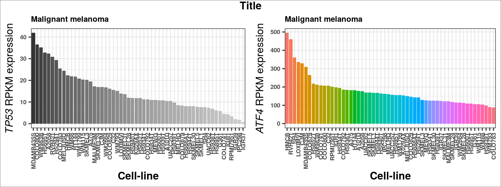
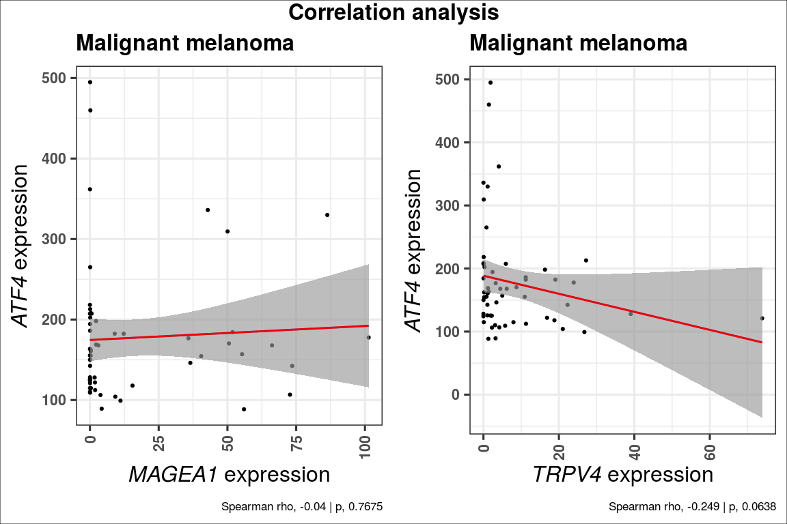
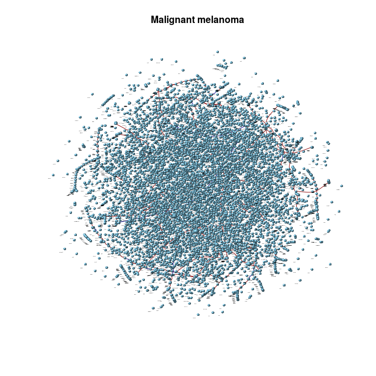
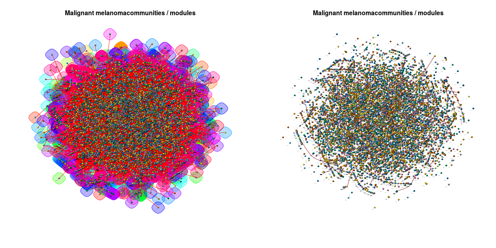

AunerLab\_CCLE
================
Kevin Blighe
2020-01-27

-   [Set-up](#set-up)
    -   [install and load necessary packages](#install-and-load-necessary-packages)
    -   [download scripts](#download-scripts)
    -   [download data](#download-data)
-   [Prepare data](#prepare-data)
    -   [read in and tidy expression data](#read-in-and-tidy-expression-data)
    -   [read in metadata for cell-lines](#read-in-metadata-for-cell-lines)
    -   [view the primary histological types](#view-the-primary-histological-types)
    -   [view the different histological sub-types](#view-the-different-histological-sub-types)
    -   [check numbers of cell-lines in each category](#check-numbers-of-cell-lines-in-each-category)
-   [Case study 1: multiple myeloma correlations](#case-study-1-multiple-myeloma-correlations)
    -   [extract names of plasma cell myeloma / multiple myeloma lines](#extract-names-of-plasma-cell-myeloma-multiple-myeloma-lines)
    -   [which MM lines are not in the expression data?](#which-mm-lines-are-not-in-the-expression-data)
    -   [filter expression data to only include multiple myeloma lines](#filter-expression-data-to-only-include-multiple-myeloma-lines)
    -   [Visualise data](#visualise-data)
        -   [barplot](#barplot)
        -   [correlation plot and analysis](#correlation-plot-and-analysis)
-   [Case study 2: malignant melanoma](#case-study-2-malignant-melanoma)
    -   [extract names of malignant melanoma cell-lines](#extract-names-of-malignant-melanoma-cell-lines)
    -   [which melanoma lines are not in the expression data?](#which-melanoma-lines-are-not-in-the-expression-data)
    -   [generate some plots for melanoma](#generate-some-plots-for-melanoma)
    -   [filter expression data to only include multiple myeloma lines](#filter-expression-data-to-only-include-multiple-myeloma-lines-1)
-   [Construct a correlation network and check modules / communities of genes](#construct-a-correlation-network-and-check-modules-communities-of-genes)
    -   [Create a graph adjacency based on correlation distances between genes in pairwise fashion.](#create-a-graph-adjacency-based-on-correlation-distances-between-genes-in-pairwise-fashion.)
    -   [configure the graph, filter out edges, and convert to a minimum spanning tree (MST):](#configure-the-graph-filter-out-edges-and-convert-to-a-minimum-spanning-tree-mst)
    -   [Identify communities in the tree object based on Louvain method](#identify-communities-in-the-tree-object-based-on-louvain-method)
    -   [further analyses](#further-analyses)
        -   [check the vertex degree, i.e., number of edges / connections to each vertex](#check-the-vertex-degree-i.e.-number-of-edges-connections-to-each-vertex)
        -   [output the gene-to-module assignments](#output-the-gene-to-module-assignments)
        -   [calculate Kleinberg's hub centrality scores](#calculate-kleinbergs-hub-centrality-scores)
-   [Session info / Tidy up](#session-info-tidy-up)

Set-up
======

install and load necessary packages
-----------------------------------

``` r
  if (!requireNamespace('BiocManager', quietly = TRUE))
    install.packages('BiocManager')

  if (!requireNamespace('ggplot2', quietly = TRUE))
    BiocManager::install('ggplot2')

  if (!requireNamespace('reshape2', quietly = TRUE))
    BiocManager::install('reshape2')

  if (!requireNamespace('data.table', quietly = TRUE))
    BiocManager::install('data.table')

  if (!requireNamespace('gridExtra', quietly = TRUE))
    BiocManager::install('gridExtra')

  if (!requireNamespace('grid', quietly = TRUE))
    BiocManager::install('grid')

  library(ggplot2)
  library(grid)
  library(gridExtra)
```

download scripts
----------------

Download the 2 functions in the '*R*' directory on this Github repo, either directly or via `git clone`, and ensure that these are placed in a directory called '*R*' in your current working directory, i.e.:

-   R/ccle\_barplot.R

-   R/ccle\_correlation.R

*HINT: to check what is your current working directory, type `getwd()`. It can also be set to something different via `setwd()`*

download data
-------------

Download the files *CCLE\_RNAseq\_genes\_rpkm\_20180929.gct.gz* and *Cell\_lines\_annotations\_20181226.txt* from <https://portals.broadinstitute.org/ccle/data> (sign in required), and place them into a directory called '*data*' in your current working directory, i.e.:

-   data/CCLE\_RNAseq\_genes\_rpkm\_20180929.gct.gz

-   data/Cell\_lines\_annotations\_20181226.txt

Prepare data
============

read in and tidy expression data
--------------------------------

``` r
  ccle <- data.table::fread(
    "gunzip -c data/CCLE_RNAseq_genes_rpkm_20180929.gct.gz",
    header = TRUE,
    sep = '\t',
    stringsAsFactors = FALSE,
    skip = 2,
    data.table = FALSE)

  # set rownames
  rownames(ccle) <- make.unique(ccle$Description)

  # remove first 2 columns to have only numerical data
  ccle <- ccle[,3:ncol(ccle)]

  # tidy up colnames
  colnames(ccle) <- gsub("^X", "", gsub("\\.\\.ACH\\.[0-9]*\\.$", "", colnames(ccle)))
```

read in metadata for cell-lines
-------------------------------

``` r
  sampleinfo <- read.csv(
    "data/Cell_lines_annotations_20181226.txt",
    header = TRUE,
    sep = "\t",
    stringsAsFactors = FALSE,
    skip = 0)
```

view the primary histological types
-----------------------------------

``` r
  sort(unique(sampleinfo$Histology))
```

    ##  [1] ""                                                          
    ##  [2] "carcinoid-endocrine_tumour"                                
    ##  [3] "carcinoma"                                                 
    ##  [4] "chondrosarcoma"                                            
    ##  [5] "Ewings_sarcoma-peripheral_primitive_neuroectodermal_tumour"
    ##  [6] "fibrosarcoma"                                              
    ##  [7] "giant_cell_tumour"                                         
    ##  [8] "glioma"                                                    
    ##  [9] "haematopoietic_neoplasm"                                   
    ## [10] "leiomyosarcoma"                                            
    ## [11] "lymphoblastoid"                                            
    ## [12] "lymphoid_neoplasm"                                         
    ## [13] "malignant_fibrous_histiocytoma-pleomorphic_sarcoma"        
    ## [14] "malignant_melanoma"                                        
    ## [15] "meningioma"                                                
    ## [16] "mesothelioma"                                              
    ## [17] "neuroblastoma"                                             
    ## [18] "osteosarcoma"                                              
    ## [19] "other"                                                     
    ## [20] "primitive_neuroectodermal_tumour-medulloblastoma"          
    ## [21] "rhabdoid_tumour"                                           
    ## [22] "rhabdomyosarcoma"                                          
    ## [23] "sarcoma"                                                   
    ## [24] "sex_cord-stromal_tumour"

view the different histological sub-types
-----------------------------------------

``` r
  sort(unique(sampleinfo$Hist_Subtype1))
```

    ##  [1] ""                                                        
    ##  [2] "acute_lymphoblastic_B_cell_leukaemia"                    
    ##  [3] "acute_lymphoblastic_T_cell_leukaemia"                    
    ##  [4] "acute_myeloid_leukaemia"                                 
    ##  [5] "adenocarcinoma"                                          
    ##  [6] "adult_T_cell_lymphoma-leukaemia"                         
    ##  [7] "alveolar"                                                
    ##  [8] "anaplastic_carcinoma"                                    
    ##  [9] "anaplastic_large_cell_lymphoma"                          
    ## [10] "astrocytoma"                                             
    ## [11] "astrocytoma_Grade_III"                                   
    ## [12] "astrocytoma_Grade_III-IV"                                
    ## [13] "astrocytoma_Grade_IV"                                    
    ## [14] "barrett_associated_adenocarcinoma"                       
    ## [15] "B_cell"                                                  
    ## [16] "B_cell_lymphoma_unspecified"                             
    ## [17] "blast_phase_chronic_myeloid_leukaemia"                   
    ## [18] "Brenner_tumour"                                          
    ## [19] "bronchioloalveolar_adenocarcinoma"                       
    ## [20] "Burkitt_lymphoma"                                        
    ## [21] "carcinosarcoma-malignant_mesodermal_mixed_tumour"        
    ## [22] "chronic_lymphocytic_leukaemia-small_lymphocytic_lymphoma"
    ## [23] "chronic_myeloid_leukaemia"                               
    ## [24] "clear_cell_carcinoma"                                    
    ## [25] "clear_cell_renal_cell_carcinoma"                         
    ## [26] "dedifferentiated"                                        
    ## [27] "diffuse_adenocarcinoma"                                  
    ## [28] "diffuse_large_B_cell_lymphoma"                           
    ## [29] "ductal_carcinoma"                                        
    ## [30] "embryonal"                                               
    ## [31] "endometrioid_carcinoma"                                  
    ## [32] "essential_thrombocythaemia"                              
    ## [33] "follicular_carcinoma"                                    
    ## [34] "gliosarcoma"                                             
    ## [35] "granulosa_cell_tumour"                                   
    ## [36] "hepatoblastoma"                                          
    ## [37] "hepatocellular_carcinoma"                                
    ## [38] "Hodgkin_lymphoma"                                        
    ## [39] "immortalized_embryonic_fibroblast"                       
    ## [40] "immortalized_epithelial"                                 
    ## [41] "immortalized_fibroblast"                                 
    ## [42] "intestinal_adenocarcinoma"                               
    ## [43] "large_cell_carcinoma"                                    
    ## [44] "mantle_cell_lymphoma"                                    
    ## [45] "medullary_carcinoma"                                     
    ## [46] "metaplasia"                                              
    ## [47] "metaplastic_carcinoma"                                   
    ## [48] "mixed_adenosquamous_carcinoma"                           
    ## [49] "mixed_carcinoma"                                         
    ## [50] "mucinous_carcinoma"                                      
    ## [51] "mucoepidermoid_carcinoma"                                
    ## [52] "mycosis_fungoides-Sezary_syndrome"                       
    ## [53] "non_small_cell_carcinoma"                                
    ## [54] "NS"                                                      
    ## [55] "oligodendroglioma"                                       
    ## [56] "papillary_carcinoma"                                     
    ## [57] "papilloma"                                               
    ## [58] "peripheral_T_cell_lymphoma_unspecified"                  
    ## [59] "plasma_cell_myeloma"                                     
    ## [60] "renal_cell_carcinoma"                                    
    ## [61] "serous_carcinoma"                                        
    ## [62] "signet_ring_adenocarcinoma"                              
    ## [63] "small_cell_adenocarcinoma"                               
    ## [64] "small_cell_carcinoma"                                    
    ## [65] "squamous_cell_carcinoma"                                 
    ## [66] "T_cell_large_granular_lymphocytic_leukaemia"             
    ## [67] "transitional_cell_carcinoma"                             
    ## [68] "tubular_adenocarcinoma"                                  
    ## [69] "undifferentiated_adenocarcinoma"                         
    ## [70] "undifferentiated_carcinoma"

check numbers of cell-lines in each category
--------------------------------------------

``` r
  sort(table(sampleinfo$Histology))
```

    ## 
    ##                                                            
    ##                                                          1 
    ##                                 carcinoid-endocrine_tumour 
    ##                                                          1 
    ##                                               fibrosarcoma 
    ##                                                          1 
    ##                                             lymphoblastoid 
    ##                                                          1 
    ##         malignant_fibrous_histiocytoma-pleomorphic_sarcoma 
    ##                                                          1 
    ##                                    sex_cord-stromal_tumour 
    ##                                                          1 
    ##                                             leiomyosarcoma 
    ##                                                          2 
    ##                                          giant_cell_tumour 
    ##                                                          3 
    ##                                                 meningioma 
    ##                                                          3 
    ##                                            rhabdoid_tumour 
    ##                                                          3 
    ##                                                    sarcoma 
    ##                                                          3 
    ##                                             chondrosarcoma 
    ##                                                          4 
    ##           primitive_neuroectodermal_tumour-medulloblastoma 
    ##                                                          4 
    ##                                               osteosarcoma 
    ##                                                         10 
    ##                                               mesothelioma 
    ##                                                         11 
    ##                                           rhabdomyosarcoma 
    ##                                                         11 
    ## Ewings_sarcoma-peripheral_primitive_neuroectodermal_tumour 
    ##                                                         12 
    ##                                                      other 
    ##                                                         12 
    ##                                              neuroblastoma 
    ##                                                         17 
    ##                                    haematopoietic_neoplasm 
    ##                                                         53 
    ##                                         malignant_melanoma 
    ##                                                         61 
    ##                                                     glioma 
    ##                                                         65 
    ##                                          lymphoid_neoplasm 
    ##                                                        130 
    ##                                                  carcinoma 
    ##                                                        651

``` r
  sort(table(sampleinfo$Hist_Subtype1))
```

    ## 
    ##                                                          
    ##                                                        1 
    ##                          adult_T_cell_lymphoma-leukaemia 
    ##                                                        1 
    ##                                 astrocytoma_Grade_III-IV 
    ##                                                        1 
    ##                        barrett_associated_adenocarcinoma 
    ##                                                        1 
    ##                                                   B_cell 
    ##                                                        1 
    ##                                           Brenner_tumour 
    ##                                                        1 
    ##                                         dedifferentiated 
    ##                                                        1 
    ##                                                embryonal 
    ##                                                        1 
    ##                               essential_thrombocythaemia 
    ##                                                        1 
    ##                                              gliosarcoma 
    ##                                                        1 
    ##                                    granulosa_cell_tumour 
    ##                                                        1 
    ##                        immortalized_embryonic_fibroblast 
    ##                                                        1 
    ##                                  immortalized_fibroblast 
    ##                                                        1 
    ##                                intestinal_adenocarcinoma 
    ##                                                        1 
    ##                                      medullary_carcinoma 
    ##                                                        1 
    ##                                               metaplasia 
    ##                                                        1 
    ##                                    metaplastic_carcinoma 
    ##                                                        1 
    ##                                          mixed_carcinoma 
    ##                                                        1 
    ##                                       mucinous_carcinoma 
    ##                                                        1 
    ##                                        oligodendroglioma 
    ##                                                        1 
    ##                                      papillary_carcinoma 
    ##                                                        1 
    ##                                                papilloma 
    ##                                                        1 
    ##                   peripheral_T_cell_lymphoma_unspecified 
    ##                                                        1 
    ##              T_cell_large_granular_lymphocytic_leukaemia 
    ##                                                        1 
    ##                                   endometrioid_carcinoma 
    ##                                                        2 
    ##                                           hepatoblastoma 
    ##                                                        2 
    ##                               signet_ring_adenocarcinoma 
    ##                                                        2 
    ##                                small_cell_adenocarcinoma 
    ##                                                        2 
    ##                                   tubular_adenocarcinoma 
    ##                                                        2 
    ##                                                 alveolar 
    ##                                                        3 
    ##                                    astrocytoma_Grade_III 
    ##                                                        3 
    ##         carcinosarcoma-malignant_mesodermal_mixed_tumour 
    ##                                                        3 
    ##                                chronic_myeloid_leukaemia 
    ##                                                        3 
    ##                                   diffuse_adenocarcinoma 
    ##                                                        3 
    ##                                 mucoepidermoid_carcinoma 
    ##                                                        3 
    ##                        mycosis_fungoides-Sezary_syndrome 
    ##                                                        3 
    ##                               undifferentiated_carcinoma 
    ##                                                        3 
    ##                                     mantle_cell_lymphoma 
    ##                                                        4 
    ##                                         serous_carcinoma 
    ##                                                        4 
    ##                          undifferentiated_adenocarcinoma 
    ##                                                        4 
    ##                                     anaplastic_carcinoma 
    ##                                                        5 
    ##                           anaplastic_large_cell_lymphoma 
    ##                                                        5 
    ##                        bronchioloalveolar_adenocarcinoma 
    ##                                                        5 
    ## chronic_lymphocytic_leukaemia-small_lymphocytic_lymphoma 
    ##                                                        5 
    ##                                     follicular_carcinoma 
    ##                                                        5 
    ##                                  immortalized_epithelial 
    ##                                                        6 
    ##                            mixed_adenosquamous_carcinoma 
    ##                                                        6 
    ##                              B_cell_lymphoma_unspecified 
    ##                                                        8 
    ##                                     clear_cell_carcinoma 
    ##                                                        8 
    ##                                              astrocytoma 
    ##                                                       11 
    ##                                         Burkitt_lymphoma 
    ##                                                       11 
    ##                    blast_phase_chronic_myeloid_leukaemia 
    ##                                                       12 
    ##                                         Hodgkin_lymphoma 
    ##                                                       12 
    ##                          clear_cell_renal_cell_carcinoma 
    ##                                                       13 
    ##                     acute_lymphoblastic_B_cell_leukaemia 
    ##                                                       15 
    ##                                     large_cell_carcinoma 
    ##                                                       15 
    ##                     acute_lymphoblastic_T_cell_leukaemia 
    ##                                                       16 
    ##                                     renal_cell_carcinoma 
    ##                                                       17 
    ##                            diffuse_large_B_cell_lymphoma 
    ##                                                       18 
    ##                              transitional_cell_carcinoma 
    ##                                                       22 
    ##                                 hepatocellular_carcinoma 
    ##                                                       24 
    ##                                 non_small_cell_carcinoma 
    ##                                                       26 
    ##                                      plasma_cell_myeloma 
    ##                                                       29 
    ##                                  acute_myeloid_leukaemia 
    ##                                                       37 
    ##                                     astrocytoma_Grade_IV 
    ##                                                       37 
    ##                                     small_cell_carcinoma 
    ##                                                       54 
    ##                                         ductal_carcinoma 
    ##                                                       61 
    ##                                  squamous_cell_carcinoma 
    ##                                                       80 
    ##                                           adenocarcinoma 
    ##                                                      156 
    ##                                                       NS 
    ##                                                      272

Case study 1: multiple myeloma correlations
===========================================

extract names of plasma cell myeloma / multiple myeloma lines
-------------------------------------------------------------

``` r
  MMlines <- sampleinfo[grep("plasma_cell_myeloma", sampleinfo$Hist_Subtype1),1]
```

which MM lines are not in the expression data?
----------------------------------------------

``` r
  MMlines[-which(MMlines %in% colnames(ccle))]
```

    ## [1] "PCM6_HAEMATOPOIETIC_AND_LYMPHOID_TISSUE"
    ## [2] "HTK_HAEMATOPOIETIC_AND_LYMPHOID_TISSUE"

filter expression data to only include multiple myeloma lines
-------------------------------------------------------------

``` r
  MMccle <- ccle[,which(colnames(ccle) %in% MMlines)]

  colnames(MMccle)
```

    ##  [1] "AMO1_HAEMATOPOIETIC_AND_LYMPHOID_TISSUE"     
    ##  [2] "EJM_HAEMATOPOIETIC_AND_LYMPHOID_TISSUE"      
    ##  [3] "HUNS1_HAEMATOPOIETIC_AND_LYMPHOID_TISSUE"    
    ##  [4] "JJN3_HAEMATOPOIETIC_AND_LYMPHOID_TISSUE"     
    ##  [5] "KARPAS620_HAEMATOPOIETIC_AND_LYMPHOID_TISSUE"
    ##  [6] "KE97_HAEMATOPOIETIC_AND_LYMPHOID_TISSUE"     
    ##  [7] "KHM1B_HAEMATOPOIETIC_AND_LYMPHOID_TISSUE"    
    ##  [8] "KMM1_HAEMATOPOIETIC_AND_LYMPHOID_TISSUE"     
    ##  [9] "KMS11_HAEMATOPOIETIC_AND_LYMPHOID_TISSUE"    
    ## [10] "KMS12BM_HAEMATOPOIETIC_AND_LYMPHOID_TISSUE"  
    ## [11] "KMS18_HAEMATOPOIETIC_AND_LYMPHOID_TISSUE"    
    ## [12] "KMS20_HAEMATOPOIETIC_AND_LYMPHOID_TISSUE"    
    ## [13] "KMS21BM_HAEMATOPOIETIC_AND_LYMPHOID_TISSUE"  
    ## [14] "KMS26_HAEMATOPOIETIC_AND_LYMPHOID_TISSUE"    
    ## [15] "KMS27_HAEMATOPOIETIC_AND_LYMPHOID_TISSUE"    
    ## [16] "KMS28BM_HAEMATOPOIETIC_AND_LYMPHOID_TISSUE"  
    ## [17] "KMS34_HAEMATOPOIETIC_AND_LYMPHOID_TISSUE"    
    ## [18] "L363_HAEMATOPOIETIC_AND_LYMPHOID_TISSUE"     
    ## [19] "LP1_HAEMATOPOIETIC_AND_LYMPHOID_TISSUE"      
    ## [20] "MM1S_HAEMATOPOIETIC_AND_LYMPHOID_TISSUE"     
    ## [21] "MOLP2_HAEMATOPOIETIC_AND_LYMPHOID_TISSUE"    
    ## [22] "MOLP8_HAEMATOPOIETIC_AND_LYMPHOID_TISSUE"    
    ## [23] "NCIH929_HAEMATOPOIETIC_AND_LYMPHOID_TISSUE"  
    ## [24] "OPM2_HAEMATOPOIETIC_AND_LYMPHOID_TISSUE"     
    ## [25] "RPMI8226_HAEMATOPOIETIC_AND_LYMPHOID_TISSUE" 
    ## [26] "SKMM2_HAEMATOPOIETIC_AND_LYMPHOID_TISSUE"    
    ## [27] "U266B1_HAEMATOPOIETIC_AND_LYMPHOID_TISSUE"

``` r
  MMccle[1:5,1:5]
```

    ##            AMO1_HAEMATOPOIETIC_AND_LYMPHOID_TISSUE
    ## DDX11L1                                  0.0713687
    ## WASH7P                                   3.7704500
    ## MIR1302-11                               0.0495422
    ## FAM138A                                  0.0187277
    ## OR4G4P                                   0.0080356
    ##            EJM_HAEMATOPOIETIC_AND_LYMPHOID_TISSUE
    ## DDX11L1                                 0.0254640
    ## WASH7P                                  4.4963200
    ## MIR1302-11                              0.0113129
    ## FAM138A                                 0.0213822
    ## OR4G4P                                  0.0183491
    ##            HUNS1_HAEMATOPOIETIC_AND_LYMPHOID_TISSUE
    ## DDX11L1                                   0.0262787
    ## WASH7P                                    3.4151300
    ## MIR1302-11                                0.0583743
    ## FAM138A                                   0.0183886
    ## OR4G4P                                    0.0236703
    ##            JJN3_HAEMATOPOIETIC_AND_LYMPHOID_TISSUE
    ## DDX11L1                                  0.0152990
    ## WASH7P                                   5.1118900
    ## MIR1302-11                               0.0113282
    ## FAM138A                                  0.0071370
    ## OR4G4P                                   0.0000000
    ##            KARPAS620_HAEMATOPOIETIC_AND_LYMPHOID_TISSUE
    ## DDX11L1                                       0.0765178
    ## WASH7P                                        4.4198000
    ## MIR1302-11                                    0.1335500
    ## FAM138A                                       0.1147360
    ## OR4G4P                                        0.0492304

Visualise data
--------------

### barplot

Read the barplot function code:

``` r
  source('R/ccle_barplot.R')
```

Now, generate 3 barplots:

``` r
  p1 <- ccle_barplot(
    ccledata = ccle,
    clinicaldata = sampleinfo,
    keyword = 'Hodgkin_lymphoma',
    gene = 'TP53',
    title = 'Hodgkin\'s lymphoma',
    xlab = 'Cell-line',
    greyscale = TRUE,
    colour = NULL,
    titlesize = 18,
    axissize = 14)
  
  p2 <- ccle_barplot(
    ccledata = ccle,
    clinicaldata = sampleinfo,
    keyword = 'chronic_myeloid_leukaemia',
    gene = 'TP53',
    title = 'Chronic myeloid leukaemia',
    xlab = 'Cell-line',
    greyscale = FALSE,
    titlesize = 18,
    axissize = 14)

  p3 <- ccle_barplot(
    ccledata = ccle,
    clinicaldata = sampleinfo,
    keyword = 'immortalized_epithelial',
    gene = 'TP53',
    title = 'Immortalized epithelial',
    xlab = 'Cell-line',
    greyscale = FALSE,
    colour = 'royalblue',
    titlesize = 18,
    axissize = 14)
```

Now, plot these together:

``` r
  grid.arrange(p1, p2, p3, ncol = 3, nrow = 1,
    top = textGrob('Title', gp = gpar(fontsize = 24, fontface="bold")))

  grid.rect(gp = gpar(fill = NA))
```


### correlation plot and analysis

Read the correlation function code:

``` r
  source('R/ccle_correlation.R')
```

Now, generate 2 correlation plots:

``` r
  p1 <- ccle_correlation(
    ccledata = ccle,
    clinicaldata = sampleinfo,
    keyword = 'Hodgkin_lymphoma',
    gene1 = 'TP53',
    gene2 = 'ATM',
    title = 'Hodgkin\'s lymphoma',
    titlesize = 24,
    axissize = 16)

  p2 <- ccle_correlation(
    ccledata = ccle,
    clinicaldata = sampleinfo,
    keyword = 'acute_myeloid_leukaemia',
    gene1 = 'TXNIP',
    gene2 = 'BRCA1',
    title = 'Acute myeloid leukaemia',
    titlesize = 24,
    axissize = 16)
```

Now, plot these together:

``` r
  grid.arrange(p1, p2, ncol = 2, nrow = 1,
    top = textGrob('Correlation analysis', gp = gpar(fontsize = 24, fontface="bold")))

  grid.rect(gp = gpar(fill = NA))
```


Case study 2: malignant melanoma
================================

The malignant melanoma information is only stored in the '*Histology*' column in the metadata, and not the '*Hist\_Subtype1*' column, like multiple myeloma.

extract names of malignant melanoma cell-lines
----------------------------------------------

``` r
  melanoma_lines <- sampleinfo[grep("malignant_melanoma", sampleinfo$Histology),1]
  melanoma_lines
```

    ##  [1] "RVH421_SKIN"        "HS895T_FIBROBLAST"  "HS940T_FIBROBLAST" 
    ##  [4] "SKMEL1_SKIN"        "HS936T_SKIN"        "SKMEL28_SKIN"      
    ##  [7] "SH4_SKIN"           "CJM_SKIN"           "WM115_SKIN"        
    ## [10] "COLO800_SKIN"       "UACC62_SKIN"        "RPMI7951_SKIN"     
    ## [13] "COLO783_SKIN"       "COLO792_SKIN"       "WM983B_SKIN"       
    ## [16] "WM793_SKIN"         "MDAMB435S_SKIN"     "WM1799_SKIN"       
    ## [19] "MEWO_SKIN"          "WM88_SKIN"          "IGR1_SKIN"         
    ## [22] "GRM_SKIN"           "A2058_SKIN"         "IGR39_SKIN"        
    ## [25] "COLO818_SKIN"       "HT144_SKIN"         "SKMEL31_SKIN"      
    ## [28] "HS839T_FIBROBLAST"  "HS939T_SKIN"        "HS688AT_FIBROBLAST"
    ## [31] "HS600T_FIBROBLAST"  "A101D_SKIN"         "COLO829_SKIN"      
    ## [34] "IPC298_SKIN"        "SKMEL24_SKIN"       "K029AX_SKIN"       
    ## [37] "HS695T_SKIN"        "CHL1_SKIN"          "SKMEL3_SKIN"       
    ## [40] "HMCB_SKIN"          "MALME3M_SKIN"       "MELJUSO_SKIN"      
    ## [43] "SKMEL2_SKIN"        "COLO679_SKIN"       "MELHO_SKIN"        
    ## [46] "G361_SKIN"          "COLO741_SKIN"       "SKMEL30_SKIN"      
    ## [49] "C32_SKIN"           "A375_SKIN"          "HS294T_SKIN"       
    ## [52] "SKMEL5_SKIN"        "HS944T_SKIN"        "WM2664_SKIN"       
    ## [55] "COLO849_SKIN"       "LOXIMVI_SKIN"       "UACC257_SKIN"      
    ## [58] "IGR37_SKIN"         "HS834T_FIBROBLAST"  "HS852T_SKIN"       
    ## [61] "HS934T_FIBROBLAST"

which melanoma lines are not in the expression data?
----------------------------------------------------

``` r
  melanoma_lines[-which(melanoma_lines %in% colnames(ccle))]
```

    ## [1] "GRM_SKIN"     "COLO818_SKIN" "CHL1_SKIN"    "SKMEL2_SKIN"  "COLO849_SKIN"

generate some plots for melanoma
--------------------------------

``` r
  p1 <- ccle_barplot(
    ccledata = ccle,
    clinicaldata = sampleinfo,
    keyword = 'melanoma',
    gene = 'TP53',
    title = 'Malignant melanoma',
    xlab = 'Cell-line',
    greyscale = TRUE,
    colour = NULL,
    titlesize = 18,
    axissize = 14)
  
  p2 <- ccle_barplot(
    ccledata = ccle,
    clinicaldata = sampleinfo,
    keyword = 'melanoma',
    gene = 'ATF4',
    title = 'Malignant melanoma',
    xlab = 'Cell-line',
    greyscale = FALSE,
    titlesize = 18,
    axissize = 14)

  grid.arrange(p1, p2, ncol = 2, nrow = 1,
    top = textGrob('Title', gp = gpar(fontsize = 24, fontface="bold")))

  grid.rect(gp = gpar(fill = NA))
```



``` r
  p1 <- ccle_correlation(
    ccledata = ccle,
    clinicaldata = sampleinfo,
    keyword = 'melanoma',
    gene1 = 'MAGEA1',
    gene2 = 'ATF4',
    title = 'Malignant melanoma',
    titlesize = 24,
    axissize = 16)

  p2 <- ccle_correlation(
    ccledata = ccle,
    clinicaldata = sampleinfo,
    keyword = 'melanoma',
    gene1 = 'TRPV4',
    gene2 = 'ATF4',
    title = 'Malignant melanoma',
    titlesize = 24,
    axissize = 16)

  grid.arrange(p1, p2, ncol = 2, nrow = 1,
    top = textGrob('Correlation analysis', gp = gpar(fontsize = 24, fontface="bold")))

  grid.rect(gp = gpar(fill = NA))
```



filter expression data to only include multiple myeloma lines
-------------------------------------------------------------

``` r
  melanoma_ccle <- ccle[,which(colnames(ccle) %in% melanoma_lines)]

  colnames(melanoma_ccle)
```

    ##  [1] "A101D_SKIN"         "A2058_SKIN"         "A375_SKIN"         
    ##  [4] "C32_SKIN"           "CJM_SKIN"           "COLO679_SKIN"      
    ##  [7] "COLO741_SKIN"       "COLO783_SKIN"       "COLO792_SKIN"      
    ## [10] "COLO800_SKIN"       "COLO829_SKIN"       "G361_SKIN"         
    ## [13] "HMCB_SKIN"          "HS294T_SKIN"        "HS600T_FIBROBLAST" 
    ## [16] "HS688AT_FIBROBLAST" "HS695T_SKIN"        "HS834T_FIBROBLAST" 
    ## [19] "HS839T_FIBROBLAST"  "HS852T_SKIN"        "HS895T_FIBROBLAST" 
    ## [22] "HS934T_FIBROBLAST"  "HS936T_SKIN"        "HS939T_SKIN"       
    ## [25] "HS940T_FIBROBLAST"  "HS944T_SKIN"        "HT144_SKIN"        
    ## [28] "IGR1_SKIN"          "IGR37_SKIN"         "IGR39_SKIN"        
    ## [31] "IPC298_SKIN"        "K029AX_SKIN"        "LOXIMVI_SKIN"      
    ## [34] "MALME3M_SKIN"       "MDAMB435S_SKIN"     "MELHO_SKIN"        
    ## [37] "MELJUSO_SKIN"       "MEWO_SKIN"          "RPMI7951_SKIN"     
    ## [40] "RVH421_SKIN"        "SH4_SKIN"           "SKMEL1_SKIN"       
    ## [43] "SKMEL24_SKIN"       "SKMEL28_SKIN"       "SKMEL30_SKIN"      
    ## [46] "SKMEL31_SKIN"       "SKMEL3_SKIN"        "SKMEL5_SKIN"       
    ## [49] "UACC257_SKIN"       "UACC62_SKIN"        "WM115_SKIN"        
    ## [52] "WM1799_SKIN"        "WM2664_SKIN"        "WM793_SKIN"        
    ## [55] "WM88_SKIN"          "WM983B_SKIN"

``` r
  melanoma_ccle[1:5,1:5]
```

    ##            A101D_SKIN A2058_SKIN A375_SKIN  C32_SKIN  CJM_SKIN
    ## DDX11L1     0.0175621  0.0281291 0.0312566 0.0238036 0.0395393
    ## WASH7P      3.8001400  3.5826500 4.3733500 2.4044100 4.1089100
    ## MIR1302-11  0.0585176  0.0178527 0.0000000 0.0211505 0.0479076
    ## FAM138A     0.0061446  0.0168715 0.0145813 0.0066627 0.0100610
    ## OR4G4P      0.0079095  0.0000000 0.0093847 0.0171526 0.0194261

Construct a correlation network and check modules / communities of genes
========================================================================

Here, we will be using my own tutorial: [https://www.biostars.org/p/285296/](Network%20plot%20from%20expression%20data%20in%20R%20using%20igraph)

First, let's tidy up the workspace a bit by removing the main CCLE expression table, and also clearing memory:

``` r
  rm(ccle)
  gc()
```

    ##            used  (Mb) gc trigger  (Mb) max used  (Mb)
    ## Ncells   882801  47.2    1923325 102.8  1923325 102.8
    ## Vcells 64801588 494.4  102956434 785.5 66227727 505.3

First, we need to install *igraph* and *zFPKM*:

``` r
  if (!requireNamespace('igraph', quietly = TRUE))
    BiocManager::install('igraph')

  if (!requireNamespace('zFPKM', quietly = TRUE))
    BiocManager::install('zFPKM')

  library(zFPKM)
  library(igraph)
```

We will construct a network using a Z-transformed melanoma expression data. This network will be a co-expression network based on Pearson correlation. However, as the data is quite large (~56000 coding and non-coding genes), we would normally require a lot of memory to construct such a network. Therefore, we will reduce the size of the data using a 2-step process:

-   filtering for protein coding genes only

-   filtering out low-expressed genes

``` r
  if (!requireNamespace('igraph', quietly = TRUE))
    BiocManager::install('igraph')

  library(biomaRt)

  mart <- useMart('ENSEMBL_MART_ENSEMBL', host = 'useast.ensembl.org')
  mart <- useDataset('hsapiens_gene_ensembl', mart)
  annotLookup <- getBM(
    mart = mart,
    attributes = c(
      'hgnc_symbol',
      'entrezgene_id',
      'ensembl_gene_id',
      'gene_biotype'),
    filter = 'hgnc_symbol',
    values = rownames(melanoma_ccle),
    uniqueRows=TRUE)

  head(annotLookup)
```

    ##   hgnc_symbol entrezgene_id ensembl_gene_id   gene_biotype
    ## 1     AADACL3        126767 ENSG00000188984 protein_coding
    ## 2     AADACL4        343066 ENSG00000204518 protein_coding
    ## 3       ACAP3        116983 ENSG00000131584 protein_coding
    ## 4       ACOT7         11332 ENSG00000097021 protein_coding
    ## 5       ACTL8         81569 ENSG00000117148 protein_coding
    ## 6      ACTRT2        140625 ENSG00000169717 protein_coding

``` r
  prot <- annotLookup[which(annotLookup$gene_biotype == 'protein_coding'),'hgnc_symbol']

  melanoma_ccle <- melanoma_ccle[which(rownames(melanoma_ccle) %in% prot),]
  dim(melanoma_ccle)
```

    ## [1] 17920    56

So, we are left with 17920 genes across 56 malignant melanoma cell-lines. Let's reduce this further by removing genes of low expression - here we remove genes with mean expression &lt; 7:

``` r
  expressed_cutoff <- 7
```

``` r
  lowexpression_filt <- apply(melanoma_ccle, 1, mean) >= expressed_cutoff
  table(lowexpression_filt)
```

    ## lowexpression_filt
    ## FALSE  TRUE 
    ## 11522  6398

``` r
  melanoma_ccle <- melanoma_ccle[lowexpression_filt,]
  dim(melanoma_ccle)
```

    ## [1] 6398   56

So, we are left with 6398 genes.

Create a graph adjacency based on correlation distances between genes in pairwise fashion.
------------------------------------------------------------------------------------------

``` r
  g <- graph.adjacency(
    as.matrix(as.dist(cor(t(zFPKM(melanoma_ccle)), method = 'pearson'))),
    mode = 'undirected',
    weighted = TRUE,
    diag = FALSE)
```

configure the graph, filter out edges, and convert to a minimum spanning tree (MST):
------------------------------------------------------------------------------------

Set a title and correlation cut-off (graph edges below this threshold will be removed):

``` r
  title <- 'Malignant melanoma'
  cor_cutoff <- 0.7
```

``` r
  # Simplfy the adjacency object
  g <- simplify(g, remove.multiple = TRUE, remove.loops = TRUE)

  # Colour negative correlation edges as blue
  E(g)[which(E(g)$weight<0)]$color <- 'darkblue'

  # Colour positive correlation edges as red
  E(g)[which(E(g)$weight>0)]$color <- 'darkred'

  # Convert edge weights to absolute values
  E(g)$weight <- abs(E(g)$weight)

  # Remove edges below absolute correlation cutoff
  g <- delete_edges(g, E(g)[which(E(g)$weight < cor_cutoff)])

  # Remove any vertices remaining that have no edges
  g <- delete.vertices(g, degree(g)==0)

  # Assign names to the graph vertices (optional)
  V(g)$name <- V(g)$name

  # Change shape of graph vertices
  V(g)$shape <- 'sphere'

  # Change colour of graph vertices
  V(g)$color <- 'skyblue'

  # Change colour of vertex frames
  V(g)$vertex.frame.color <- 'white'

  # Scale the size of the vertices to be proportional to the level of expression of each gene represented by each vertex
  # Multiply scaled vales by a factor of 10
  scale01 <- function(x){(x-min(x))/(max(x)-min(x))}
  vSizes <- (scale01(apply(melanoma_ccle, 1, mean)) + 1.0) * 2

  # Amplify or decrease the width of the edges
  edgeweights <- E(g)$weight * 2.0

  # Convert the graph adjacency object into a minimum spanning tree based on Prim's algorithm
  mst <- mst(g, algorithm = 'prim')

  # Plot the tree object
  plot(
    mst,
    #layout = layout.fruchterman.reingold,
    edge.curved = TRUE,
    vertex.size = vSizes,
    vertex.label.dist = -0.5,
    vertex.label.color = 'black',
    asp = FALSE,
    vertex.label.cex = 0.1,
    edge.width = edgeweights,
    edge.arrow.mode = 0,
    main = title)
```



    ##             used   (Mb) gc trigger   (Mb)  max used   (Mb)
    ## Ncells   5809711  310.3   31872378 1702.2  34525258 1843.9
    ## Vcells 218433734 1666.6  625808028 4774.6 782259039 5968.2

    ##            used  (Mb) gc trigger   (Mb)  max used   (Mb)
    ## Ncells  5809602 310.3   25497903 1361.8  34525258 1843.9
    ## Vcells 90703929 692.1  500646423 3819.7 782259039 5968.2

Identify communities in the tree object based on Louvain method
---------------------------------------------------------------

``` r
  mst.communities <- cluster_louvain(mst, weights=NULL)
  mst.clustering <- make_clusters(mst, membership = mst.communities$membership)
  V(mst)$color <- mst.communities$membership + 1

  par(mfrow=c(1,2))
  plot(
    mst.clustering, mst,
    #layout = layout.fruchterman.reingold,
    edge.curved = TRUE,
    vertex.size = vSizes,
    vertex.label.dist = -0.5,
    vertex.label.color = 'black',
    asp = FALSE,
    vertex.label.cex = 0.1,
    edge.width = edgeweights,
    edge.arrow.mode = 0,
    main=paste0(title, 'communities / modules'))

  plot(
    mst,
    #layout = layout.fruchterman.reingold,
    edge.curved = TRUE,
    vertex.size = vSizes,
    vertex.label.dist = -0.5,
    vertex.label.color = 'black',
    asp = FALSE,
    vertex.label.cex = 0.1,
    edge.width = edgeweights,
    edge.arrow.mode = 0,
    main=paste0(title, 'communities / modules'))
```



further analyses
----------------

### check the vertex degree, i.e., number of edges / connections to each vertex

``` r
  head(degree(mst))
```

    ##   NOC2L   ISG15    AGRN    SDF4 B3GALT6  UBE2J2 
    ##       1       1       1       1       1       2

``` r
  sort(degree(mst), decreasing = TRUE)[1:20]
```

    ##   KRT14    ALX1   PAGE1  MAGEA4   CD248    COMP   CSAG1  MAGEA1   TRPV4 RPS6KA1 
    ##    1319    1106     715     304     259     177     138     110      60       6 
    ##  S100A4    SDE2   NOL10    USO1   NOP56    NUDC    RCC1   UQCRH    BCL9  ATP8B2 
    ##       6       6       6       6       6       5       5       5       5       5

A lot of these top genes have known roles in melanoma.

What about the ATF genes?

``` r
  degree(mst)[grep('ATF', names(degree(mst)))]
```

    ##  ATF6  ATF2 ATF6B  ATF1  AATF  ATF5  ATF4 
    ##     1     2     1     1     2     1     2

Not too important in melanoma, it seems; although, there could be other reasons for this finding.

### output the gene-to-module assignments

``` r
  commSummary <- data.frame(
    Gene = mst.communities$names,
    Community = mst.communities$membership)
  commSummary <- commSummary[order(commSummary$Community),]
```

In which modules are the ATF genes?

``` r
  commSummary[grep('ATF', commSummary$Gene),]
```

    ##       Gene Community
    ## 486   ATF6       486
    ## 969   ATF2       969
    ## 2040 ATF6B      2040
    ## 3776  ATF1      3776
    ## 4965  AATF      4965
    ## 5688  ATF5      5688
    ## 6111  ATF4      6111

``` r
  commSummary[which(commSummary$Community == 6111),]
```

    ##      Gene Community
    ## 6111 ATF4      6111

So, purely looking at *ATF4*, it is in its own module with no other genes. This again just means that it is not important in melanomas.

### calculate Kleinberg's hub centrality scores

``` r
  hub <- hub_score(mst, scale = TRUE)
  hub <- hub$vector[order(hub$vector, decreasing = TRUE)]
  hub[1:20]
```

    ##       KRT14        ALX1       PAGE1      MAGEA4       CD248        COMP 
    ## 1.000000000 0.838514026 0.542077331 0.230477635 0.196360879 0.134192570 
    ##       CSAG1      MAGEA1       TRPV4     RPS6KA1      S100A4        SDE2 
    ## 0.104624716 0.083396513 0.045489007 0.004548901 0.004548901 0.004548901 
    ##       NOL10        USO1       NOP56        NUDC        RCC1       UQCRH 
    ## 0.004548901 0.004548901 0.004548901 0.003790751 0.003790751 0.003790751 
    ##        BCL9      ATP8B2 
    ## 0.003790751 0.003790751

The hub score is another way of determining important genes in a network. We can see that the genes scoring the highest are also the ones that have the highest vertex degrees, which makes sense, and, again, these are genes already known to be important in melanoma in the literature. In fact, *KRT14* scores 1.0, which is the highest possible score, attesting to its role in melanoma signaling. *ALX1*, along with the others, also has a well-established role in melanoma.

Session info / Tidy up
======================

    ##            used  (Mb) gc trigger   (Mb)  max used   (Mb)
    ## Ncells  5833231 311.6   16318659  871.6  34525258 1843.9
    ## Vcells 90812776 692.9  578498840 4413.6 782259039 5968.2

``` r
sessionInfo()
```

    ## R version 3.6.2 (2019-12-12)
    ## Platform: x86_64-pc-linux-gnu (64-bit)
    ## Running under: Ubuntu 16.04.6 LTS
    ## 
    ## Matrix products: default
    ## BLAS:   /usr/lib/atlas-base/atlas/libblas.so.3.0
    ## LAPACK: /usr/lib/atlas-base/atlas/liblapack.so.3.0
    ## 
    ## locale:
    ##  [1] LC_CTYPE=pt_BR.UTF-8       LC_NUMERIC=C              
    ##  [3] LC_TIME=en_GB.UTF-8        LC_COLLATE=pt_BR.UTF-8    
    ##  [5] LC_MONETARY=en_GB.UTF-8    LC_MESSAGES=pt_BR.UTF-8   
    ##  [7] LC_PAPER=en_GB.UTF-8       LC_NAME=C                 
    ##  [9] LC_ADDRESS=C               LC_TELEPHONE=C            
    ## [11] LC_MEASUREMENT=en_GB.UTF-8 LC_IDENTIFICATION=C       
    ## 
    ## attached base packages:
    ## [1] grid      stats     graphics  grDevices utils     datasets  methods  
    ## [8] base     
    ## 
    ## other attached packages:
    ## [1] biomaRt_2.42.0 igraph_1.2.4.1 zFPKM_1.8.0    gridExtra_2.3  ggplot2_3.2.1 
    ## [6] knitr_1.26    
    ## 
    ## loaded via a namespace (and not attached):
    ##  [1] httr_1.4.1                  Biobase_2.46.0             
    ##  [3] tidyr_1.0.0                 bit64_0.9-7                
    ##  [5] assertthat_0.2.1            askpass_1.1                
    ##  [7] BiocFileCache_1.10.2        BiocManager_1.30.9         
    ##  [9] stats4_3.6.2                blob_1.2.0                 
    ## [11] GenomeInfoDbData_1.2.2      yaml_2.2.0                 
    ## [13] progress_1.2.2              pillar_1.4.2               
    ## [15] RSQLite_2.1.2               backports_1.1.5            
    ## [17] lattice_0.20-38             glue_1.3.1                 
    ## [19] digest_0.6.22               GenomicRanges_1.38.0       
    ## [21] XVector_0.26.0              checkmate_1.9.4            
    ## [23] colorspace_1.4-1            htmltools_0.4.0            
    ## [25] Matrix_1.2-17               plyr_1.8.4                 
    ## [27] XML_3.98-1.20               pkgconfig_2.0.3            
    ## [29] zlibbioc_1.32.0             purrr_0.3.3                
    ## [31] scales_1.0.0                BiocParallel_1.20.0        
    ## [33] openssl_1.4.1               tibble_2.1.3               
    ## [35] IRanges_2.20.0              withr_2.1.2                
    ## [37] SummarizedExperiment_1.16.0 BiocGenerics_0.32.0        
    ## [39] lazyeval_0.2.2              magrittr_1.5               
    ## [41] crayon_1.3.4                memoise_1.1.0              
    ## [43] evaluate_0.14               tools_3.6.2                
    ## [45] data.table_1.12.6           prettyunits_1.0.2          
    ## [47] hms_0.5.2                   lifecycle_0.1.0            
    ## [49] matrixStats_0.55.0          stringr_1.4.0              
    ## [51] S4Vectors_0.24.0            munsell_0.5.0              
    ## [53] DelayedArray_0.12.0         AnnotationDbi_1.48.0       
    ## [55] compiler_3.6.2              GenomeInfoDb_1.22.0        
    ## [57] rlang_0.4.1                 RCurl_1.95-4.12            
    ## [59] rappdirs_0.3.1              bitops_1.0-6               
    ## [61] labeling_0.3                rmarkdown_1.17             
    ## [63] gtable_0.3.0                curl_4.2                   
    ## [65] DBI_1.0.0                   reshape2_1.4.3             
    ## [67] R6_2.4.1                    dplyr_0.8.3                
    ## [69] bit_1.1-14                  zeallot_0.1.0              
    ## [71] stringi_1.4.3               parallel_3.6.2             
    ## [73] Rcpp_1.0.3                  vctrs_0.2.0                
    ## [75] dbplyr_1.4.2                tidyselect_0.2.5           
    ## [77] xfun_0.11
