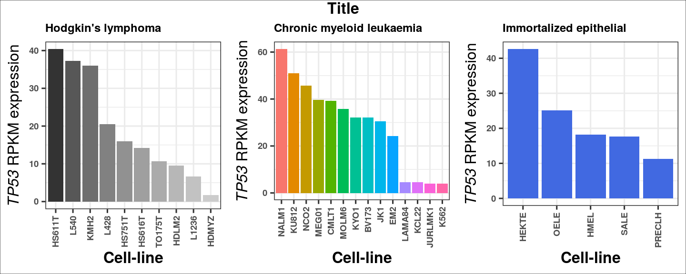
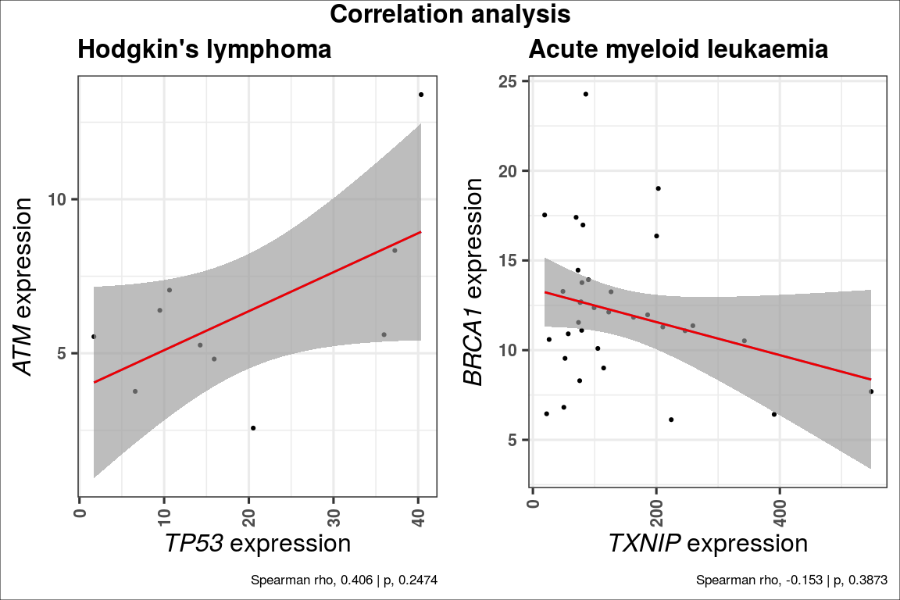

AunerLab\_CCLE
================
Kevin Blighe
2019-11-23

-   [Set-up](#set-up)
    -   [install and load necessary packages](#install-and-load-necessary-packages)
    -   [download scripts](#download-scripts)
    -   [download data](#download-data)
-   [Prepare data](#prepare-data)
    -   [read in and tidy expression data](#read-in-and-tidy-expression-data)
    -   [read in metadata for cell-lines](#read-in-metadata-for-cell-lines)
    -   [view the different histological types](#view-the-different-histological-types)
    -   [check numbers of cell-lines in each category](#check-numbers-of-cell-lines-in-each-category)
        -   [extract names of plasma cell myeloma / multiple myeloma lines](#extract-names-of-plasma-cell-myeloma-multiple-myeloma-lines)
        -   [which MM lines are not in the expression data?](#which-mm-lines-are-not-in-the-expression-data)
        -   [filter expression data to only include multiple myeloma lines](#filter-expression-data-to-only-include-multiple-myeloma-lines)
-   [Visualise data](#visualise-data)
    -   [barplot](#barplot)
    -   [correlation plot and analysis](#correlation-plot-and-analysis)
-   [Session info](#session-info)

Set-up
======

install and load necessary packages
-----------------------------------

``` r
  if (!requireNamespace('BiocManager', quietly = TRUE))
    install.packages('BiocManager')

  if (!requireNamespace('ggplot2', quietly = TRUE))
    BiocManager::install('ggplot2')

  if (!requireNamespace('reshape2', quietly = TRUE))
    BiocManager::install('reshape2')

  if (!requireNamespace('data.table', quietly = TRUE))
    BiocManager::install('data.table')

  if (!requireNamespace('gridExtra', quietly = TRUE))
    BiocManager::install('gridExtra')

  if (!requireNamespace('grid', quietly = TRUE))
    BiocManager::install('grid')

  library(ggplot2)
  library(grid)
  library(gridExtra)
```

download scripts
----------------

Download the 2 functions in the '*R*' directory on this Github repo, either directly or via `git clone`, and ensure that these are placed in a directory called '*R*' in your current working directory, i.e.:

-   R/ccle\_barplot.R

-   R/ccle\_correlation.R

*HINT: to check what is your current working directory, type `getwd()`. It can also be set to something different via `setwd()`*

download data
-------------

Download the files *CCLE\_RNAseq\_genes\_rpkm\_20180929.gct.gz* and *Cell\_lines\_annotations\_20181226.txt* from <https://portals.broadinstitute.org/ccle/data> (sign in required), and place them into a directory called '*data*' in your current working directory, i.e.:

-   data/CCLE\_RNAseq\_genes\_rpkm\_20180929.gct.gz

-   data/Cell\_lines\_annotations\_20181226.txt

Prepare data
============

read in and tidy expression data
--------------------------------

``` r
  ccle <- data.table::fread(
    "gunzip -c data/CCLE_RNAseq_genes_rpkm_20180929.gct.gz",
    header = TRUE,
    sep = '\t',
    stringsAsFactors = FALSE,
    skip = 2,
    data.table = FALSE)

  # set rownames
  rownames(ccle) <- make.unique(ccle$Description)

  # remove first 2 columns to have only numerical data
  ccle <- ccle[,3:ncol(ccle)]

  # tidy up colnames
  colnames(ccle) <- gsub("^X", "", gsub("\\.\\.ACH\\.[0-9]*\\.$", "", colnames(ccle)))
```

read in metadata for cell-lines
-------------------------------

``` r
  sampleinfo <- read.csv(
    "data/Cell_lines_annotations_20181226.txt",
    header = TRUE,
    sep = "\t",
    stringsAsFactors = FALSE,
    skip = 0)
```

view the different histological types
-------------------------------------

``` r
  sort(unique(sampleinfo$Hist_Subtype1))
```

    ##  [1] ""                                                        
    ##  [2] "acute_lymphoblastic_B_cell_leukaemia"                    
    ##  [3] "acute_lymphoblastic_T_cell_leukaemia"                    
    ##  [4] "acute_myeloid_leukaemia"                                 
    ##  [5] "adenocarcinoma"                                          
    ##  [6] "adult_T_cell_lymphoma-leukaemia"                         
    ##  [7] "alveolar"                                                
    ##  [8] "anaplastic_carcinoma"                                    
    ##  [9] "anaplastic_large_cell_lymphoma"                          
    ## [10] "astrocytoma"                                             
    ## [11] "astrocytoma_Grade_III"                                   
    ## [12] "astrocytoma_Grade_III-IV"                                
    ## [13] "astrocytoma_Grade_IV"                                    
    ## [14] "barrett_associated_adenocarcinoma"                       
    ## [15] "B_cell"                                                  
    ## [16] "B_cell_lymphoma_unspecified"                             
    ## [17] "blast_phase_chronic_myeloid_leukaemia"                   
    ## [18] "Brenner_tumour"                                          
    ## [19] "bronchioloalveolar_adenocarcinoma"                       
    ## [20] "Burkitt_lymphoma"                                        
    ## [21] "carcinosarcoma-malignant_mesodermal_mixed_tumour"        
    ## [22] "chronic_lymphocytic_leukaemia-small_lymphocytic_lymphoma"
    ## [23] "chronic_myeloid_leukaemia"                               
    ## [24] "clear_cell_carcinoma"                                    
    ## [25] "clear_cell_renal_cell_carcinoma"                         
    ## [26] "dedifferentiated"                                        
    ## [27] "diffuse_adenocarcinoma"                                  
    ## [28] "diffuse_large_B_cell_lymphoma"                           
    ## [29] "ductal_carcinoma"                                        
    ## [30] "embryonal"                                               
    ## [31] "endometrioid_carcinoma"                                  
    ## [32] "essential_thrombocythaemia"                              
    ## [33] "follicular_carcinoma"                                    
    ## [34] "gliosarcoma"                                             
    ## [35] "granulosa_cell_tumour"                                   
    ## [36] "hepatoblastoma"                                          
    ## [37] "hepatocellular_carcinoma"                                
    ## [38] "Hodgkin_lymphoma"                                        
    ## [39] "immortalized_embryonic_fibroblast"                       
    ## [40] "immortalized_epithelial"                                 
    ## [41] "immortalized_fibroblast"                                 
    ## [42] "intestinal_adenocarcinoma"                               
    ## [43] "large_cell_carcinoma"                                    
    ## [44] "mantle_cell_lymphoma"                                    
    ## [45] "medullary_carcinoma"                                     
    ## [46] "metaplasia"                                              
    ## [47] "metaplastic_carcinoma"                                   
    ## [48] "mixed_adenosquamous_carcinoma"                           
    ## [49] "mixed_carcinoma"                                         
    ## [50] "mucinous_carcinoma"                                      
    ## [51] "mucoepidermoid_carcinoma"                                
    ## [52] "mycosis_fungoides-Sezary_syndrome"                       
    ## [53] "non_small_cell_carcinoma"                                
    ## [54] "NS"                                                      
    ## [55] "oligodendroglioma"                                       
    ## [56] "papillary_carcinoma"                                     
    ## [57] "papilloma"                                               
    ## [58] "peripheral_T_cell_lymphoma_unspecified"                  
    ## [59] "plasma_cell_myeloma"                                     
    ## [60] "renal_cell_carcinoma"                                    
    ## [61] "serous_carcinoma"                                        
    ## [62] "signet_ring_adenocarcinoma"                              
    ## [63] "small_cell_adenocarcinoma"                               
    ## [64] "small_cell_carcinoma"                                    
    ## [65] "squamous_cell_carcinoma"                                 
    ## [66] "T_cell_large_granular_lymphocytic_leukaemia"             
    ## [67] "transitional_cell_carcinoma"                             
    ## [68] "tubular_adenocarcinoma"                                  
    ## [69] "undifferentiated_adenocarcinoma"                         
    ## [70] "undifferentiated_carcinoma"

check numbers of cell-lines in each category
--------------------------------------------

``` r
  sort(table(sampleinfo$Hist_Subtype1))
```

    ## 
    ##                                                          
    ##                                                        1 
    ##                          adult_T_cell_lymphoma-leukaemia 
    ##                                                        1 
    ##                                 astrocytoma_Grade_III-IV 
    ##                                                        1 
    ##                        barrett_associated_adenocarcinoma 
    ##                                                        1 
    ##                                                   B_cell 
    ##                                                        1 
    ##                                           Brenner_tumour 
    ##                                                        1 
    ##                                         dedifferentiated 
    ##                                                        1 
    ##                                                embryonal 
    ##                                                        1 
    ##                               essential_thrombocythaemia 
    ##                                                        1 
    ##                                              gliosarcoma 
    ##                                                        1 
    ##                                    granulosa_cell_tumour 
    ##                                                        1 
    ##                        immortalized_embryonic_fibroblast 
    ##                                                        1 
    ##                                  immortalized_fibroblast 
    ##                                                        1 
    ##                                intestinal_adenocarcinoma 
    ##                                                        1 
    ##                                      medullary_carcinoma 
    ##                                                        1 
    ##                                               metaplasia 
    ##                                                        1 
    ##                                    metaplastic_carcinoma 
    ##                                                        1 
    ##                                          mixed_carcinoma 
    ##                                                        1 
    ##                                       mucinous_carcinoma 
    ##                                                        1 
    ##                                        oligodendroglioma 
    ##                                                        1 
    ##                                      papillary_carcinoma 
    ##                                                        1 
    ##                                                papilloma 
    ##                                                        1 
    ##                   peripheral_T_cell_lymphoma_unspecified 
    ##                                                        1 
    ##              T_cell_large_granular_lymphocytic_leukaemia 
    ##                                                        1 
    ##                                   endometrioid_carcinoma 
    ##                                                        2 
    ##                                           hepatoblastoma 
    ##                                                        2 
    ##                               signet_ring_adenocarcinoma 
    ##                                                        2 
    ##                                small_cell_adenocarcinoma 
    ##                                                        2 
    ##                                   tubular_adenocarcinoma 
    ##                                                        2 
    ##                                                 alveolar 
    ##                                                        3 
    ##                                    astrocytoma_Grade_III 
    ##                                                        3 
    ##         carcinosarcoma-malignant_mesodermal_mixed_tumour 
    ##                                                        3 
    ##                                chronic_myeloid_leukaemia 
    ##                                                        3 
    ##                                   diffuse_adenocarcinoma 
    ##                                                        3 
    ##                                 mucoepidermoid_carcinoma 
    ##                                                        3 
    ##                        mycosis_fungoides-Sezary_syndrome 
    ##                                                        3 
    ##                               undifferentiated_carcinoma 
    ##                                                        3 
    ##                                     mantle_cell_lymphoma 
    ##                                                        4 
    ##                                         serous_carcinoma 
    ##                                                        4 
    ##                          undifferentiated_adenocarcinoma 
    ##                                                        4 
    ##                                     anaplastic_carcinoma 
    ##                                                        5 
    ##                           anaplastic_large_cell_lymphoma 
    ##                                                        5 
    ##                        bronchioloalveolar_adenocarcinoma 
    ##                                                        5 
    ## chronic_lymphocytic_leukaemia-small_lymphocytic_lymphoma 
    ##                                                        5 
    ##                                     follicular_carcinoma 
    ##                                                        5 
    ##                                  immortalized_epithelial 
    ##                                                        6 
    ##                            mixed_adenosquamous_carcinoma 
    ##                                                        6 
    ##                              B_cell_lymphoma_unspecified 
    ##                                                        8 
    ##                                     clear_cell_carcinoma 
    ##                                                        8 
    ##                                              astrocytoma 
    ##                                                       11 
    ##                                         Burkitt_lymphoma 
    ##                                                       11 
    ##                    blast_phase_chronic_myeloid_leukaemia 
    ##                                                       12 
    ##                                         Hodgkin_lymphoma 
    ##                                                       12 
    ##                          clear_cell_renal_cell_carcinoma 
    ##                                                       13 
    ##                     acute_lymphoblastic_B_cell_leukaemia 
    ##                                                       15 
    ##                                     large_cell_carcinoma 
    ##                                                       15 
    ##                     acute_lymphoblastic_T_cell_leukaemia 
    ##                                                       16 
    ##                                     renal_cell_carcinoma 
    ##                                                       17 
    ##                            diffuse_large_B_cell_lymphoma 
    ##                                                       18 
    ##                              transitional_cell_carcinoma 
    ##                                                       22 
    ##                                 hepatocellular_carcinoma 
    ##                                                       24 
    ##                                 non_small_cell_carcinoma 
    ##                                                       26 
    ##                                      plasma_cell_myeloma 
    ##                                                       29 
    ##                                  acute_myeloid_leukaemia 
    ##                                                       37 
    ##                                     astrocytoma_Grade_IV 
    ##                                                       37 
    ##                                     small_cell_carcinoma 
    ##                                                       54 
    ##                                         ductal_carcinoma 
    ##                                                       61 
    ##                                  squamous_cell_carcinoma 
    ##                                                       80 
    ##                                           adenocarcinoma 
    ##                                                      156 
    ##                                                       NS 
    ##                                                      272

### extract names of plasma cell myeloma / multiple myeloma lines

``` r
  MMlines <- sampleinfo[grep("plasma_cell_myeloma", sampleinfo$Hist_Subtype1),1]
```

### which MM lines are not in the expression data?

``` r
  MMlines[-which(MMlines %in% colnames(ccle))]
```

    ## [1] "PCM6_HAEMATOPOIETIC_AND_LYMPHOID_TISSUE"
    ## [2] "HTK_HAEMATOPOIETIC_AND_LYMPHOID_TISSUE"

### filter expression data to only include multiple myeloma lines

``` r
  MMccle <- ccle[,which(colnames(ccle) %in% MMlines)]

  colnames(MMccle)
```

    ##  [1] "AMO1_HAEMATOPOIETIC_AND_LYMPHOID_TISSUE"     
    ##  [2] "EJM_HAEMATOPOIETIC_AND_LYMPHOID_TISSUE"      
    ##  [3] "HUNS1_HAEMATOPOIETIC_AND_LYMPHOID_TISSUE"    
    ##  [4] "JJN3_HAEMATOPOIETIC_AND_LYMPHOID_TISSUE"     
    ##  [5] "KARPAS620_HAEMATOPOIETIC_AND_LYMPHOID_TISSUE"
    ##  [6] "KE97_HAEMATOPOIETIC_AND_LYMPHOID_TISSUE"     
    ##  [7] "KHM1B_HAEMATOPOIETIC_AND_LYMPHOID_TISSUE"    
    ##  [8] "KMM1_HAEMATOPOIETIC_AND_LYMPHOID_TISSUE"     
    ##  [9] "KMS11_HAEMATOPOIETIC_AND_LYMPHOID_TISSUE"    
    ## [10] "KMS12BM_HAEMATOPOIETIC_AND_LYMPHOID_TISSUE"  
    ## [11] "KMS18_HAEMATOPOIETIC_AND_LYMPHOID_TISSUE"    
    ## [12] "KMS20_HAEMATOPOIETIC_AND_LYMPHOID_TISSUE"    
    ## [13] "KMS21BM_HAEMATOPOIETIC_AND_LYMPHOID_TISSUE"  
    ## [14] "KMS26_HAEMATOPOIETIC_AND_LYMPHOID_TISSUE"    
    ## [15] "KMS27_HAEMATOPOIETIC_AND_LYMPHOID_TISSUE"    
    ## [16] "KMS28BM_HAEMATOPOIETIC_AND_LYMPHOID_TISSUE"  
    ## [17] "KMS34_HAEMATOPOIETIC_AND_LYMPHOID_TISSUE"    
    ## [18] "L363_HAEMATOPOIETIC_AND_LYMPHOID_TISSUE"     
    ## [19] "LP1_HAEMATOPOIETIC_AND_LYMPHOID_TISSUE"      
    ## [20] "MM1S_HAEMATOPOIETIC_AND_LYMPHOID_TISSUE"     
    ## [21] "MOLP2_HAEMATOPOIETIC_AND_LYMPHOID_TISSUE"    
    ## [22] "MOLP8_HAEMATOPOIETIC_AND_LYMPHOID_TISSUE"    
    ## [23] "NCIH929_HAEMATOPOIETIC_AND_LYMPHOID_TISSUE"  
    ## [24] "OPM2_HAEMATOPOIETIC_AND_LYMPHOID_TISSUE"     
    ## [25] "RPMI8226_HAEMATOPOIETIC_AND_LYMPHOID_TISSUE" 
    ## [26] "SKMM2_HAEMATOPOIETIC_AND_LYMPHOID_TISSUE"    
    ## [27] "U266B1_HAEMATOPOIETIC_AND_LYMPHOID_TISSUE"

``` r
  MMccle[1:5,1:5]
```

    ##            AMO1_HAEMATOPOIETIC_AND_LYMPHOID_TISSUE
    ## DDX11L1                                  0.0713687
    ## WASH7P                                   3.7704500
    ## MIR1302-11                               0.0495422
    ## FAM138A                                  0.0187277
    ## OR4G4P                                   0.0080356
    ##            EJM_HAEMATOPOIETIC_AND_LYMPHOID_TISSUE
    ## DDX11L1                                 0.0254640
    ## WASH7P                                  4.4963200
    ## MIR1302-11                              0.0113129
    ## FAM138A                                 0.0213822
    ## OR4G4P                                  0.0183491
    ##            HUNS1_HAEMATOPOIETIC_AND_LYMPHOID_TISSUE
    ## DDX11L1                                   0.0262787
    ## WASH7P                                    3.4151300
    ## MIR1302-11                                0.0583743
    ## FAM138A                                   0.0183886
    ## OR4G4P                                    0.0236703
    ##            JJN3_HAEMATOPOIETIC_AND_LYMPHOID_TISSUE
    ## DDX11L1                                  0.0152990
    ## WASH7P                                   5.1118900
    ## MIR1302-11                               0.0113282
    ## FAM138A                                  0.0071370
    ## OR4G4P                                   0.0000000
    ##            KARPAS620_HAEMATOPOIETIC_AND_LYMPHOID_TISSUE
    ## DDX11L1                                       0.0765178
    ## WASH7P                                        4.4198000
    ## MIR1302-11                                    0.1335500
    ## FAM138A                                       0.1147360
    ## OR4G4P                                        0.0492304

Visualise data
==============

barplot
-------

Read the barplot function code:

``` r
  source('R/ccle_barplot.R')
```

Now, generate 3 barplots:

``` r
  p1 <- ccle_barplot(
    ccledata = ccle,
    clinicaldata = sampleinfo,
    keyword = 'Hodgkin_lymphoma',
    gene = 'TP53',
    title = 'Hodgkin\'s lymphoma',
    xlab = 'Cell-line',
    greyscale = TRUE,
    colour = NULL,
    titlesize = 18,
    axissize = 14)
  
  p2 <- ccle_barplot(
    ccledata = ccle,
    clinicaldata = sampleinfo,
    keyword = 'chronic_myeloid_leukaemia',
    gene = 'TP53',
    title = 'Chronic myeloid leukaemia',
    xlab = 'Cell-line',
    greyscale = FALSE,
    titlesize = 18,
    axissize = 14)

  p3 <- ccle_barplot(
    ccledata = ccle,
    clinicaldata = sampleinfo,
    keyword = 'immortalized_epithelial',
    gene = 'TP53',
    title = 'Immortalized epithelial',
    xlab = 'Cell-line',
    greyscale = FALSE,
    colour = 'royalblue',
    titlesize = 18,
    axissize = 14)
```

Now, plot these together:

``` r
  grid.arrange(p1, p2, p3, ncol = 3, nrow = 1,
    top = textGrob('Title', gp = gpar(fontsize = 24, fontface="bold")))

  grid.rect(gp = gpar(fill = NA))
```



correlation plot and analysis
-----------------------------

Read the correlation function code:

``` r
  source('R/ccle_correlation.R')
```

Now, generate 2 correlation plots:

``` r
  p1 <- ccle_correlation(
    ccledata = ccle,
    clinicaldata = sampleinfo,
    keyword = 'Hodgkin_lymphoma',
    gene1 = 'TP53',
    gene2 = 'ATM',
    title = 'Hodgkin\'s lymphoma',
    titlesize = 24,
    axissize = 16)

  p2 <- ccle_correlation(
    ccledata = ccle,
    clinicaldata = sampleinfo,
    keyword = 'acute_myeloid_leukaemia',
    gene1 = 'TXNIP',
    gene2 = 'BRCA1',
    title = 'Acute myeloid leukaemia',
    titlesize = 24,
    axissize = 16)
```

Now, plot these together:

``` r
  grid.arrange(p1, p2, ncol = 2, nrow = 1,
    top = textGrob('Correlation analysis', gp = gpar(fontsize = 24, fontface="bold")))

  grid.rect(gp = gpar(fill = NA))
```



Session info
============

``` r
sessionInfo()
```

    ## R version 3.6.1 (2019-07-05)
    ## Platform: x86_64-pc-linux-gnu (64-bit)
    ## Running under: Ubuntu 16.04.6 LTS
    ## 
    ## Matrix products: default
    ## BLAS:   /usr/lib/atlas-base/atlas/libblas.so.3.0
    ## LAPACK: /usr/lib/atlas-base/atlas/liblapack.so.3.0
    ## 
    ## locale:
    ##  [1] LC_CTYPE=pt_BR.UTF-8       LC_NUMERIC=C              
    ##  [3] LC_TIME=en_GB.UTF-8        LC_COLLATE=pt_BR.UTF-8    
    ##  [5] LC_MONETARY=en_GB.UTF-8    LC_MESSAGES=pt_BR.UTF-8   
    ##  [7] LC_PAPER=en_GB.UTF-8       LC_NAME=C                 
    ##  [9] LC_ADDRESS=C               LC_TELEPHONE=C            
    ## [11] LC_MEASUREMENT=en_GB.UTF-8 LC_IDENTIFICATION=C       
    ## 
    ## attached base packages:
    ## [1] grid      stats     graphics  grDevices utils     datasets  methods  
    ## [8] base     
    ## 
    ## other attached packages:
    ## [1] gridExtra_2.3 ggplot2_3.2.1 knitr_1.26   
    ## 
    ## loaded via a namespace (and not attached):
    ##  [1] Rcpp_1.0.3         magrittr_1.5       tidyselect_0.2.5   munsell_0.5.0     
    ##  [5] colorspace_1.4-1   R6_2.4.1           rlang_0.4.1        plyr_1.8.4        
    ##  [9] stringr_1.4.0      dplyr_0.8.3        tools_3.6.1        data.table_1.12.6 
    ## [13] gtable_0.3.0       xfun_0.11          withr_2.1.2        htmltools_0.4.0   
    ## [17] assertthat_0.2.1   yaml_2.2.0         lazyeval_0.2.2     digest_0.6.22     
    ## [21] tibble_2.1.3       crayon_1.3.4       reshape2_1.4.3     purrr_0.3.3       
    ## [25] BiocManager_1.30.9 glue_1.3.1         evaluate_0.14      rmarkdown_1.17    
    ## [29] labeling_0.3       stringi_1.4.3      compiler_3.6.1     pillar_1.4.2      
    ## [33] scales_1.0.0       pkgconfig_2.0.3
